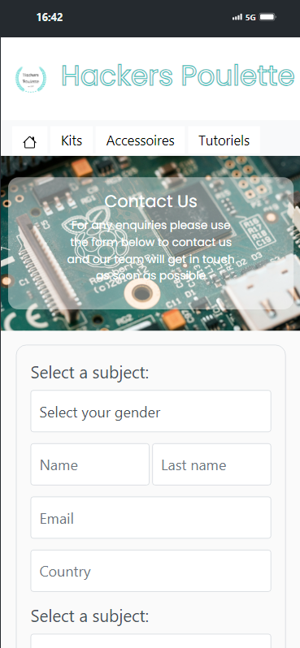
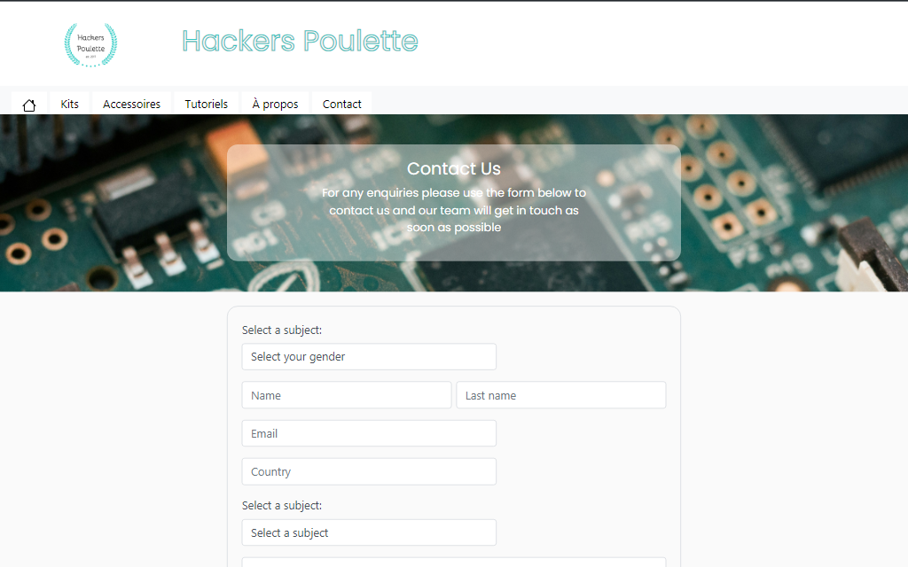

# Hackers Poulette

The project aims to create a fully functional online contact form for the company Hackers Poulette™, which sells Raspberry Pi accessory kits. The primary objective is to enable users to easily contact the company's support team.


## Authors

- [@ludoviclacroix82](https://github.com/ludoviclacroix82/)


## Technologies Used
### FrontEnd : 


### BackEnd : 


### This project uses the following technologies:

- [PHPMailer](https://github.com/PHPMailer/PHPMailer) - A PHP class for sending emails.
- [Bootstrap](https://getbootstrap.com/) - A CSS framework for responsive and modern design.

### Images

The images used in this project are provided by [Unsplash](https://unsplash.com).


## Useful Links


 
- **GitHub Repository:** [https://github.com/ludoviclacroix82/Hackers_Poulette](https://github.com/ludoviclacroix82/Weather-App)
- **Mission sur GitHub:** [https://github.com/becodeorg/CRL-KELLER-7/tree/main/2.PROJECTS/6.Weather-app](https://github.com/becodeorg/CRL-KELLER-7/blob/main/2.PROJECTS/8.Hackers_Poulette)

## Configuring Email Sending

To configure email sending with your own SMTP server, follow these steps:

1. Open the `process_form.php` file in your code editor.

2. Find the `// Server settings` section in the file.

3. Modify the following lines by replacing the values with your own SMTP server details:
   
   ```php
   // Server settings
   //$mail->SMTPDebug = SMTP::DEBUG_SERVER;                      //Enable verbose debug output
   $mail->isSMTP();
   $mail->Host = 'smtp.office365.com';  // Replace with appropriate SMTP server
   $mail->SMTPAuth = true;
   $mail->Username = 'your_email_address@example.com';  // Replace with your email address
   $mail->Password = 'your_password';  // Replace with your password
   $mail->SMTPSecure = PHPMailer::ENCRYPTION_STARTTLS;
   $mail->Port = 587;


## Screenshots

| Mobile Screenshot | Desktop Screenshot |
|---|---|
| |  |


## License
This project is not accompanied by a specific license and is therefore considered to be under copyright by default. You are free to view, modify, and distribute the code of this project for non-commercial purposes. However, please note that you do not have explicit permission to use this code in commercial or proprietary projects. If you wish to use this code in such circumstances, please contact me to obtain their authorization.


